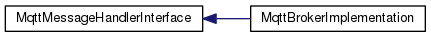
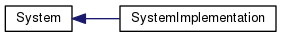

# example-mqtt-sn-gateway

This is an example implementation of the [core components](https://github.com/S3ler/core-mqtt-sn-gateway) for the mqtt-sn gateway. There is no functionality implemented. It shall only give an example structure on how to start implementing the gateway for your hardware.

## Implementation notes
Basically this project only provides non functional implementation of the 5 interface classes, namely SocketInterface, MqttMessageHandlerInterface, System, LoggerInterface and PersistenceInterface. For the documentation of the interfaces see the [core-mqtt-sn-gateway](https://github.com/S3ler/core-mqtt-sn-gateway) project

## Getting started

First clone the repository

    git clone git@github.com:S3ler/example-mqtt-sn-gateway.git

then change into folder

    cd example-mqtt-sn-gateway

finally init submodules

    git submodule update

done.
